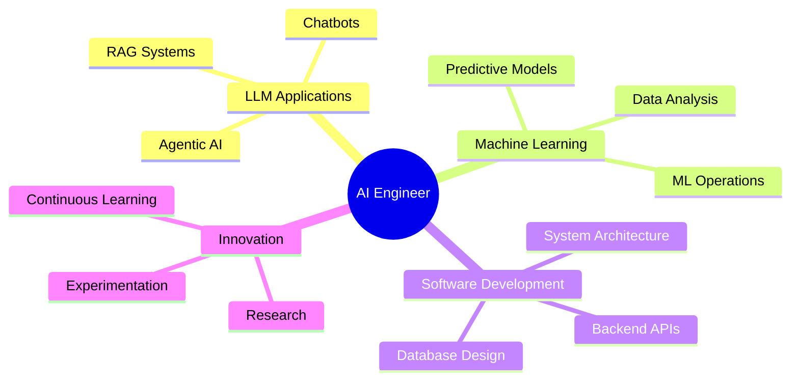

[README.md](https://github.com/user-attachments/files/25151883/README.md)
<div align="center">

# 🚀 Welcome to My AI Laboratory


[](https://rijwanul-10.github.io/)
[](https://www.linkedin.com/in/rizwanul-rudro-b19771289)
[](https://github.com/Rijwanul-10)
[](https://www.instagram.com/_rizwanul_rudro_)


</div>

---

## 👨‍💻 About Me

```python
class AIEngineer:
    def __init__(self):
        self.name = "Rijwanul Rudro"
        self.role = "AI & Machine Learning Engineer"
        self.location = "🌍 Dhaka, Bangladesh"
        self.interests = [
            "Large Language Models (LLMs)",
            "Retrieval Augmented Generation (RAG)",
            "Agentic AI Systems",
            "Natural Language Processing",
            "Machine Learning Operations"
        ]
        
    def current_focus(self):
        return {
            "learning": ["LangGraph", "Advanced RAG Techniques", "AI Agents"],
            "building": ["LLM Applications", "Chatbot Systems", "RAG Pipelines"],
            "exploring": ["Multi-Agent Systems", "Vector Databases", "Prompt Engineering"]
        }
    
    def tech_stack(self):
        return {
            "languages": ["Python", "C#"],
            "ai_frameworks": ["LangChain", "LangGraph", "Transformers", "OpenAI API","n8n"],
            "ml_tools": ["Scikit-learn", "Pandas", "NumPy", "TensorFlow"],
            "databases": ["ChromaDB", "Pinecone", "FAISS"],
            "backend": ["ASP.NET MVC", "FastAPI", "Flask"],
            "tools": ["Git", "Docker", "Jupyter", "VS Code","Cursor"]
        }

me = AIEngineer()
print(me.current_focus())
```

<div align="center">

### 🎯 Current Mission
**Building intelligent AI systems that understand, reason, and assist humans in solving complex problems**

</div>

---

## 🛠️ Tech Arsenal

<div align="center">

### 🤖 AI & Machine Learning


### 💾 Vector Databases & RAG


### 🔧 Development & Backend


### 📊 Data Science & Analytics


### ⚙️ Tools & Platforms


</div>

---

## 🔬 Featured AI Projects

<div align="center">

<table>
<tr>
<td width="50%" valign="top">

### 🤖 LLM & LangChain Applications


**Technologies:** LangChain, LangGraph, OpenAI, RAG

Building production-ready LLM applications with:
- 🔗 Advanced LangChain pipelines
- 🕸️ LangGraph for agentic workflows
- 📚 RAG systems for knowledge retrieval
- 💬 Context-aware chatbots

[](https://github.com/Rijwanul-10)

</td>
<td width="50%" valign="top">

### 🏥 Insurance Prediction ML System


**Technologies:** Python, Scikit-learn, Pandas

Advanced ML model for insurance predictions:
- 📊 Feature engineering & analysis
- 🎯 Multiple algorithm comparison
- 📈 Model optimization & tuning
- 🔍 Predictive analytics

[](https://github.com/Rijwanul-10/Insurance-Prediction)

</td>
</tr>

<tr>
<td width="50%" valign="top">

### 💬 ASP.NET MVC Chatbot


**Technologies:** ASP.NET MVC, C#, .NET Framework

Intelligent chatbot system with:
- 🏗️ MVC architecture pattern
- 🔄 Real-time communication
- 💾 Database integration
- 🎨 Responsive UI/UX

[](https://github.com/Rijwanul-10)

</td>
<td width="50%" valign="top">

### 🧠 Machine Learning Mastery


**Technologies:** Python, ML Algorithms, Jupyter

Comprehensive ML training repository:
- 📚 Hands-on ML implementations
- 🔬 Algorithm deep-dives
- 📊 Data preprocessing techniques
- 🎓 Course projects & exercises

[](https://github.com/Rijwanul-10/MachineLearningWithPython)

</td>
</tr>

<tr>
<td width="50%" valign="top">

### 🧩 Python Problem Solving


**Technologies:** Python, Algorithms, Data Structures

Competitive programming journey:
- 💻 Codeforces solutions
- 🧠 Algorithm implementations
- 🎯 Problem-solving patterns
- 📈 Continuous improvement

[](https://github.com/Rijwanul-10/Problem-Solving-by-Python)

</td>
<td width="50%" valign="top">

### 📁 Project Portfolio


**Technologies:** Various Tech Stacks

Collection of diverse projects:
- 🌟 Experimental implementations
- 🚀 Mini-projects & POCs
- 🔨 Learning exercises
- 💡 Innovation sandbox

[](https://github.com/Rijwanul-10/Projects)

</td>
</tr>
</table>

</div>

---

## 📊 GitHub Analytics

<div align="center">


</div>

---

## 🏆 GitHub Trophies

<div align="center">


</div>

---

## 💼 What Drives Me

<div align="center">



</div>

---

## 🎯 Current Focus Areas

<div align="center">

| 🔥 Area | 📚 Learning | 🚀 Building | 🎯 Goal |
|---------|-------------|-------------|---------|
| **LangChain & LangGraph** | Advanced agent orchestration | Multi-agent RAG systems | Production-ready AI apps |
| **RAG Architectures** | Hybrid search techniques | Knowledge base systems | Scalable retrieval systems |
| **LLM Fine-tuning** | Parameter-efficient methods | Domain-specific models | Custom AI solutions |
| **Vector Databases** | Optimization strategies | Efficient indexing systems | High-performance retrieval |

</div>

---

## 🌟 Recent Activity

<!--START_SECTION:activity-->
<!--END_SECTION:activity-->

---

## 📈 Contribution Graph

<div align="center">


</div>

---

## 💭 Random Dev Quote

<div align="center">


</div>

---

## 🤝 Let's Collaborate!

<div align="center">

I'm actively seeking opportunities to collaborate on:

🔹 **LLM-powered applications** using LangChain/LangGraph  
🔹 **RAG systems** for enterprise knowledge management  
🔹 **AI agent frameworks** and multi-agent orchestration  
🔹 **Open-source AI/ML projects** that make a difference  
🔹 **Innovative chatbot solutions** with advanced NLP  

### 📫 Reach Out

<a href="mailto:rizwanulkafi2003@example.com">
  
</a>
<a href="https://www.linkedin.com/in/rizwanul-rudro-b19771289">
  
</a>
<a href="https://rijwanul-10.github.io/">
  
</a>

</div>

---

<div align="center">

### 💡 "Building the future, one AI model at a time"


**Thanks for visiting! Let's build something amazing together! 🚀**


</div>
